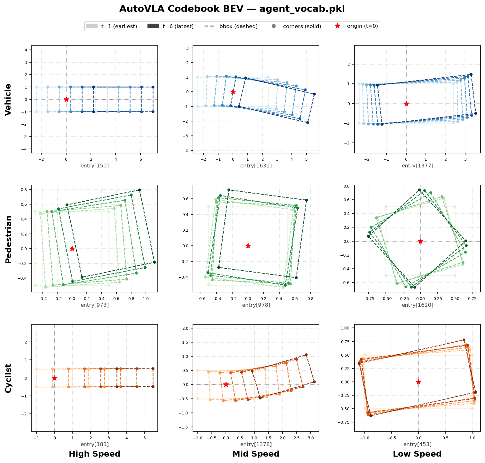

# 技术路线

> **VEGA = VLA Embedding Geometry of Action**
> 
> 研究目标：分析 VLA 模型中 action 表示的几何性质（各向同性、内在维度、流形结构、跨模型对齐性……）；
> 
> 研究对象： AutoVLA（离散 codebook token）和 OpenDriveVLA（连续轨迹坐标）。

---

## 阶段一：项目初始化

- [x] 初始化项目结构
- [x] 配置 git submodule（AutoVLA、OpenDriveVLA）
- [x] 配置 `.gitignore`
- [x] 生成中文 README 与 docs/ 文档框架
- [x] 搭建 `autovla` conda 环境，验证 Qwen2.5-VL-3B 推理流水线可运行
  - 编写 `scripts/autovla/setup_env_autovla.sh`（conda 环境 + navsim 安装）
- [x] 搭建 `drivevla` conda 环境，完成 mmcv/mmdet3d 源码编译，验证 nuScenes 推理可运行
  - 编写 `scripts/opendrivevla/setup_env_opendrivevla.sh`（conda 环境 + 编译步骤）

  <details>
  <summary>OpenDriveVLA-0.5B nuScenes val 基线结果（4×RTX 3090，2026-05-22）</summary>

  > | 评估标准 | L2@1s | L2@2s | L2@3s | L2 Avg | Col@1s | Col@2s | Col@3s | Col Avg |
  > |---------|-------|-------|-------|--------|--------|--------|--------|---------|
  > | UniAD   | 0.21  | 0.60  | 1.22  | 0.68   | 0.00%  | 0.13%  | 0.53%  | 0.22%   |
  > | STP-3   | 0.15  | 0.32  | 0.57  | 0.35   | 0.01%  | 0.06%  | 0.18%  | 0.08%   |
  >
  > 共处理 6019 个样本，推理耗时约 50 分钟。

  </details>

---

## 阶段二：基础设施——提取 Action 表示

### 2.1 AutoVLA Action 表示提取

- [x] 提取所有 action token 的静态 embedding（`embed_tokens.weight` 行向量）
  - 由于 weight tying，该向量同时也是 `lm_head` 的输出方向
  - 输出：`first_embed (2048, hidden_dim)`
  - 实现：`src/extraction/autovla/embedding.py` → `extract_static()`

  <details>
  <summary>Action Token 的初始化与训练机制</summary>

  **Step 1 — 注册 token**，`action_tokenizer.py:48`
  ```python
  tokenizer.add_tokens([f'<action_{i}>' for i in range(action_len)], special_tokens=False)
  ```

  **Step 2 — 扩展 embedding 矩阵**，`autovla.py:488`
  ```python
  self.vlm.resize_token_embeddings(len(self.processor.tokenizer))
  ```

  **Step 3 — 初始化新行**，`modeling_utils.py:2460`
  ```python
  def _init_added_embeddings_weights_with_mean(
      self, old_embeddings, new_embeddings, old_embedding_dim, old_num_tokens, added_num_tokens
  ):
  ```
  算法：以原始词表的均值和协方差构造多元正态分布，采样 2048 个新向量：
  ```python
  mean_embeddings = torch.mean(old_embeddings_weight, axis=0)
  covariance = old_centered_embeddings.T @ old_centered_embeddings / old_num_tokens
  distribution = MultivariateNormal(mean_embeddings, covariance_matrix=epsilon * covariance)  # ε=1e-9
  new_embeddings.weight.data[-added_num_tokens:, :] = distribution.sample((added_num_tokens,))
  ```
  协方差乘以 `1e-9`，使新 token 紧密聚集在质心附近，与原始 token 区分开。

  **Step 4 — 加权 loss 反传**，`autovla.py:325`
  ```python
  def training_step(self, batch, batch_idx):
  ```
  关键片段（L348-361）：
  ```python
  action_mask = (labels_flat >= self.autovla.action_start_id)
  ce_loss_all = F.cross_entropy(logits_flat, labels_flat, reduction='none')
  action_loss = ce_loss_all[action_mask]
  if action_loss.numel() > 0:
      action_loss = action_loss.mean()
  if hascot[0] == True:
      loss = loss * 40
      loss = loss + action_loss
  ```
  `loss.backward()` 后，只有本批次出现的 token 行得到梯度更新，其余行梯度为零。

  > **关键背景**
  > - **Weight tying**：`_tied_weights_keys = ["lm_head.weight"]`（`modeling_qwen2_5_vl.py:1513`）→ `lm_head.weight` 与 `embed_tokens.weight` 是同一张量
  > - **Codebook**：`agent_vocab.pkl` 中 `(2048, 6, 4, 2)` = 2048 codes × 6 timesteps × 4 bbox 顶点 × (x,y)
  > - **action_start_id = 151665**，之后的 2048 个 id 对应 `<action_0>` … `<action_2047>`

  </details>

- [x] Teacher-forcing 前向传播，在 action token 位置提取最后一层 hidden state
  - 输出：`token_ids (S, T)`、`last_hidden (S, T, hidden_dim)`
  - 实现：`src/extraction/autovla/embedding.py` → `extract_hidden()`
- [x] 批量处理 nuScenes train/val 集，结果保存为 HDF5（`.h5`）
  - 字段：`first_embed`、`token_ids`、`last_hidden`（gzip 压缩）、`sample_token`
  - 入口：`src/extraction/autovla/extract.py`；数据加载：`src/extraction/autovla/loaders.py`
- [x] Codebook BEV 可视化：3×3 子图（行=veh/ped/cyc，列=高/中/低速），每格画 6 步虚线 bbox + 实心角点
  - 数据来源：`codebook_cache/agent_vocab.pkl` → `token_all['veh/ped/cyc']` shape `(2048, 6, 4, 2)`
  - 实现：`src/analysis/autovla/codebook_bev.py`；速度阈值按各 agent p33/p67 分档

  <details>
  <summary>Codebook BEV 可视化</summary>

  

  </details>

- [x] 轨迹解码可视化：将 action token 序列通过 codebook 解码为 BEV 轨迹，批量渲染场景
  - 实现：`src/analysis/autovla/decode_trajectory.py`

### 2.2 OpenDriveVLA Action 表示提取
- [ ] Hook LLaVA backbone 最后隐层，在输出轨迹坐标 token 时保存隐向量
  - 实现：`src/extraction/opendrivevla/hidden_extractor.py`
- [ ] 提取预测轨迹坐标（`pred_trajs_dict.json`），构建 (scene_id, traj_coords, hidden_state) 三元组
- [ ] 批量推理 nuScenes 验证集，保存提取结果

---

## 阶段三：Action 空间几何分析

### 3.1 AutoVLA Codebook 几何分析
- [ ] **覆盖率分析**：codebook 对实际 nuPlan/nuScenes 轨迹空间的量化误差（重构误差分布）
  - `src/analysis/autovla/codebook_coverage.py`
- [ ] **簇内/簇间结构**：codebook 向量的 inter-cluster distance matrix，检验 K-means 是否产生均匀分割
- [ ] **轨迹语义一致性**：相邻 codebook token（`<action_i>` 与 `<action_i+1>`）对应轨迹是否语义连续（直行→转弯的过渡是否平滑）
- [ ] **Token embedding 各向同性**：计算 `<action_i>` token embedding 在 LLM embedding table 中的各向同性指标（average cosine similarity、singular value spectrum）

### 3.2 AutoVLA 隐空间几何分析
- [ ] **内在维度估计**：对 hidden states 使用 TwoNN 或 MLE 估计内在维度，比较 fast-thinking（无 CoT）vs slow-thinking（有 CoT）的差异
  - `src/analysis/autovla/intrinsic_dim.py`
- [ ] **表示各向同性**：计算 action hidden states 的 isotropy score（参考 Ethayarajh 2019）
- [ ] **CoT 对 action 表示的影响**：对比有/无 CoT 时同一场景的 action hidden vector，量化差异（cosine distance、L2 distance）

### 3.3 OpenDriveVLA 轨迹流形分析
- [ ] **轨迹分布降维**：对预测轨迹坐标用 PCA/UMAP 降维，可视化轨迹流形结构
  - `src/analysis/opendrivevla/traj_manifold.py`
- [ ] **BEV 特征与轨迹的对齐性**：计算 BEV feature vector 与对应 hidden state 的 CKA（Centered Kernel Alignment）相似度
- [ ] **连续轨迹隐空间内在维度**：与 AutoVLA 离散 hidden states 对比

### 3.4 跨模型对齐分析
- [ ] **同场景 action 表示对比**（需构建 nuScenes 上两模型的共同子集）
  - AutoVLA 输出：`(hidden_state, action_token_id)` 
  - OpenDriveVLA 输出：`(hidden_state, traj_coords)`
- [ ] **表示空间 CKA 对齐矩阵**：逐层计算两模型隐层的 CKA，定位 action 语义对齐最强的层
  - `src/analysis/cross_model_cka.py`
- [ ] **动作语义几何一致性**：相同驾驶行为（如左转直行）在两模型 hidden space 中的欧氏距离分布是否一致

---

## 阶段四：可视化与消融

- [ ] **Codebook Voronoi 可视化**：将 nuPlan 轨迹投影到 2D，画出 codebook 的 Voronoi 分割
  - `src/visualization/autovla/codebook_voronoi.py`
- [ ] **Hidden state PCA/UMAP 轨迹**：按场景类型（直行/转弯/变道）着色，检验几何可分性
  - `src/visualization/hidden_umap.py`
- [ ] **Isotropy 随训练 step 的变化曲线**（需要 AutoVLA checkpoints，若可获取）
- [ ] **消融：RFT 是否改善 action 表示几何性质**（SFT checkpoint vs RFT checkpoint 对比）

---

## 阶段五：文档与复现包

- [ ] 填充 `docs/1_INSTALL.md`（两套环境安装 + 分析工具依赖）
- [ ] 填充 `docs/2_DATA_PREP.md`（nuPlan + nuScenes 数据准备，重点是推理输出缓存）
- [ ] 填充 `docs/3_TRAIN.md`（本项目无新训练，此节记录如何复现两模型推理）
- [ ] 填充 `docs/4_EVAL.md`（几何指标计算流程）
